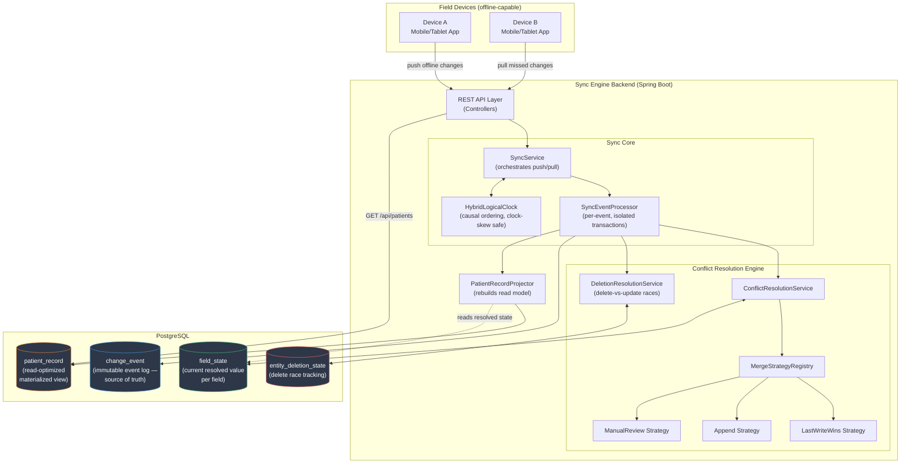
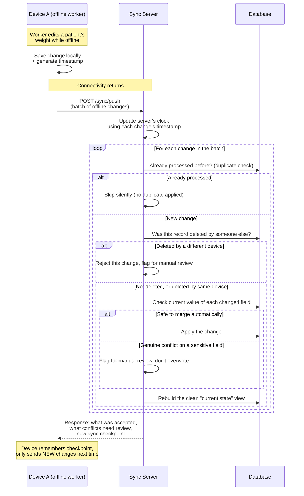
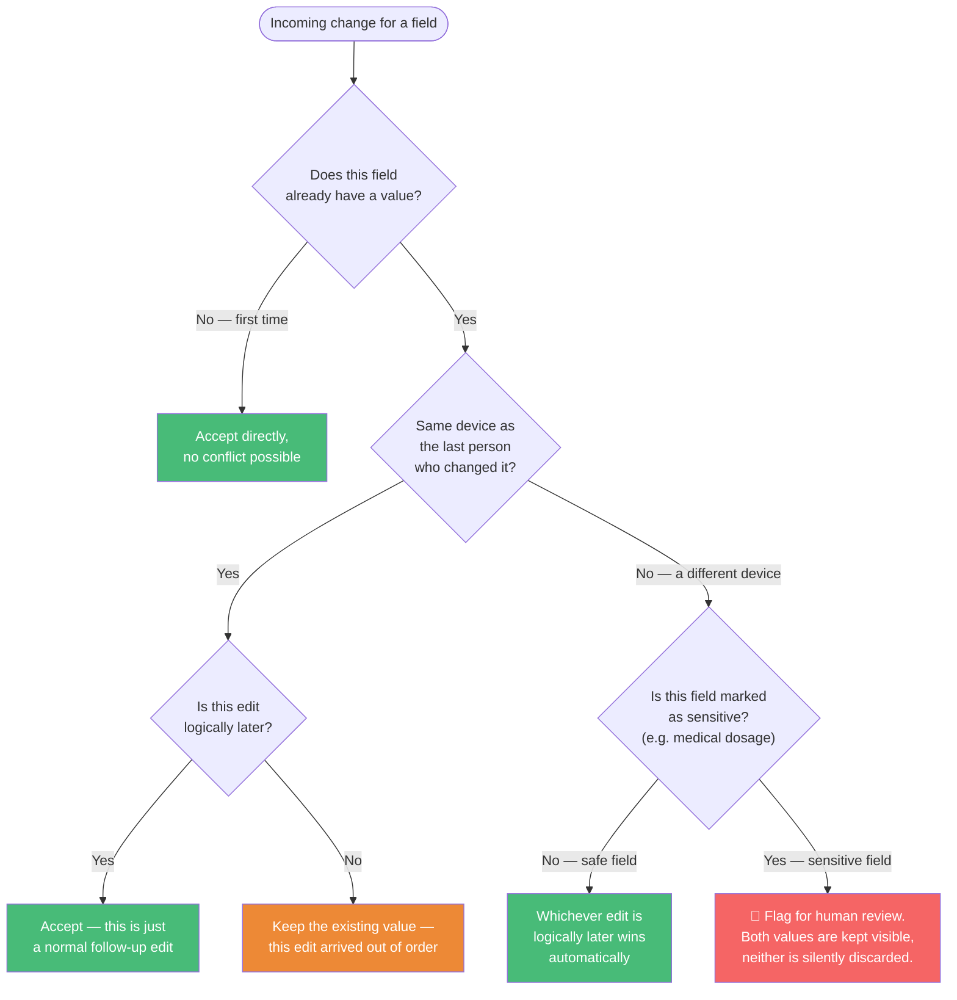

# Sync Engine — Offline-First Data Sync for Low-Connectivity Field Work

> A backend system that lets mobile and web apps keep working when there's no
> internet — and safely stitches everyone's work back together once a
> connection returns, without silently losing or overwriting anyone's data.

---

## The Problem, in Plain English

Imagine two community health workers, Priya and Arjun, both visiting patients
in a rural area with no reliable phone signal.

- Priya visits a patient in the morning, records their weight and blood
  pressure on her phone, and keeps working. No internet, so nothing has
  "saved to the cloud" yet — it's just sitting on her phone.
- Later that day, Arjun visits the *same patient* (maybe a follow-up, maybe
  he didn't know Priya had already been there) and updates the patient's
  dosage information on his own phone. Also offline.
- That evening, both of them finally get a signal at the same clinic and
  their phones try to sync.

**What should happen?** Most ordinary apps handle this badly:
- Some apps just show an error and make you manually fix it every time —
  frustrating and error-prone for someone in the field.
- Worse, many apps quietly let whoever synced *last* overwrite whoever
  synced *first* — meaning Priya's careful blood pressure reading could
  simply vanish, replaced by nothing, with no one ever told it happened.

For casual apps, that's annoying. For healthcare, agriculture, or disaster
relief work — where the data genuinely matters — **silently losing someone's
work is not acceptable.**

This project is a backend system built specifically to solve that problem
properly: let people keep working completely offline, and when they
reconnect, intelligently figure out what changed, merge the parts that are
safe to merge automatically, and clearly flag the parts that truly need a
human to make a judgment call — instead of guessing.

---

## The Big Idea, With an Analogy

Think of this system like a **shared notebook with a very smart secretary**,
instead of a single notebook everyone fights over.

- Every single thing anyone writes — "created a new patient," "changed the
  weight," "updated the dosage" — gets written down as its own **dated,
  signed note**, never erased. This is the system's permanent memory of
  everything that ever happened, from everyone, in order.
- A **secretary** reads through all those notes and keeps a tidy "current
  summary" of each patient — what their weight is *right now*, what their
  dosage is *right now* — based on the latest relevant notes.
- When two notes arrive that both try to change the *same* piece of
  information *at the same time* (like two people both trying to update a
  patient's dosage without knowing about each other), the secretary doesn't
  just guess. For sensitive information, she sets both notes aside and
  flags them: **"these two people both tried to change this — a supervisor
  needs to look at this and decide."** For less sensitive information
  (like two people updating two *different* details about the same
  patient), she's smart enough to combine both changes safely, since they
  don't actually conflict with each other.

Everything in this project is a more rigorous, software version of that
notebook-and-secretary idea.

---

## How It Works — A Walkthrough

1. **A field worker's phone or tablet works completely offline.** Every
   change they make — creating a record, editing a field — gets saved
   locally on the device immediately, no internet required, and nothing is
   ever lost even if the app closes or the phone restarts.
2. **Each change is time-stamped in a special way** that works correctly
   even if the device's clock is wrong (a real, common problem with cheap
   field devices) and even when multiple devices have never talked to each
   other before. This stamping lets the system later figure out which
   changes genuinely happened "before" others, versus which happened at
   roughly the same time by two different people who had no way of knowing
   about each other.
3. **When a connection becomes available — even briefly — the device
   "syncs."** It sends up only what changed (not the entire dataset every
   time, which would be painfully slow on a weak connection), and in return
   downloads only what it's missing from everyone else.
4. **The server intelligently merges everything.** For most fields, if one
   change is clearly later than another, it simply wins — no fuss. If two
   *different* fields on the same record were changed by two different
   people, both changes are kept — nothing is thrown away. But for fields
   marked as sensitive (like a medical dosage), if two people genuinely
   edited it around the same time with neither aware of the other, the
   system refuses to silently pick a winner — it flags it for a human to
   resolve.
5. **Deleting something is handled carefully too.** If one person deletes a
   record while someone else is simultaneously editing it, the system
   doesn't just let whichever action happened to arrive first win by
   accident — it recognizes the conflict and flags it, the same way it
   would for any other sensitive conflict.

---

## System Architecture (Technical Diagram)

For readers who want the technical shape of the system:



**In plain terms:** devices talk to the API, the API hands work to the sync
engine, the sync engine runs every incoming change through the conflict
resolution engine, the *results* of conflict resolution get stored as the
current "field state," and a separate step rebuilds a clean, easy-to-read
patient record from that field state — which is what normal app screens
actually read from.

---

## What Happens During a Sync (Step by Step)



---

## How a Conflict Gets Decided



---

## Tech Stack

| Layer | Technology |
|---|---|
| Language / Framework | Java 21, Spring Boot 4 |
| Database | PostgreSQL (uses native JSONB for flexible event storage) |
| Data Access | Spring Data JPA / Hibernate |
| Build Tool | Maven |
| Testing | JUnit 5 (Mockito & Testcontainers in progress) |

---

## Development Progress

- [x] **Phase 1** — Core CRUD API (patients can be created, read, updated, deleted)
- [x] **Phase 2** — Every change is recorded as a permanent, timestamped event
- [x] **Phase 3** — Custom clock system that correctly orders events across
      multiple offline devices, even with unreliable device clocks
- [x] **Phase 4** — Devices can push offline changes and pull missed changes,
      without re-downloading everything every time; safe against duplicate
      submissions if a sync gets interrupted partway through
- [x] **Phase 5** — Field-by-field intelligent conflict resolution, instead of
      naively overwriting whole records
- [x] **Phase 6** — Safe handling of deletions that race against concurrent
      edits; large offline batches no longer fail all-or-nothing if one
      record in the batch has a problem; clean, structured error responses
- [ ] **Phase 7** — Automated test coverage (JUnit, Mockito, Testcontainers)
- [ ] **Phase 8** — Monitoring and observability (tracking sync health, conflict
      rates, performance over time)
- [ ] **Phase 9** — A simulated multi-device demo client, to show the whole
      system working end-to-end without needing real hardware

---

## Honest Limitations (What's Not Perfect Yet)

Being upfront about this is part of good engineering practice:

1. **The system uses a simplified method for detecting "who knew about what"
   across devices.** A fully rigorous version of this (called vector
   clocks) would be more precise but adds real complexity; the current
   approach is a deliberate, documented trade-off, and is noted directly in
   the code.
2. **Only one type of record (patients) is fully wired up end-to-end.** The
   underlying design supports more record types, but the specific
   "which fields need careful conflict handling" configuration is currently
   written for patients only.
3. **New devices currently download the entire history on their first
   sync**, rather than a more efficient compact snapshot. Fine at small
   scale; would need addressing for a system with years of accumulated
   history.
4. **No automated test suite yet** — all verification so far has been
   structured manual testing (documented, repeatable test cases run through
   Postman and the database directly). Phase 7 formalizes this into real
   automated tests.

---

## Running Locally

```bash
# Requires Java 21+, Maven, and PostgreSQL running locally
createdb sync_engine_db
mvn spring-boot:run
```

---

## API Overview

| Endpoint | Method | What it does |
|---|---|---|
| `/api/patients` | `POST` | Create a new patient record |
| `/api/patients` | `GET` | List all (non-deleted) patients |
| `/api/patients/{id}` | `GET` | Get one patient by ID |
| `/api/patients/{id}` | `PUT` | Update a patient |
| `/api/patients/{id}` | `DELETE` | Soft-delete a patient |
| `/api/sync/push` | `POST` | A device submits its offline changes |
| `/api/sync/pull` | `POST` | A device fetches changes it's missing |

---


# ADR 0001: PN-Counter CRDT for dosesAdministered

**Status:** Accepted

**Context:** Two offline devices can each record doses for the same patient.
Last-write-wins would silently discard one device's doses; manual review is
absurd for a count.

**Decision:** Model the field as a state-based PN-Counter (per-device
increment/decrement maps, merged by per-device maximum). The server accepts
only a device's own entry. Counters change only via sync, never via REST.

**Consequences:** Concurrent updates can never conflict and merging is
idempotent. State grows with the number of distinct devices (see the
vector-clock ADR). A device that loses its local state must resume from its
last server-known entry, or its new increments are absorbed by max-merge.
Text CRDTs (RGA) were considered for free-text fields and scoped out:
multi-week effort, not justified for this project.


## Author

[Your Name] — backend developer in transition, building this project to
demonstrate real distributed-systems problem solving (offline-first design,
event sourcing, conflict resolution) in a practical, from-scratch Java
system rather than a tutorial clone.
